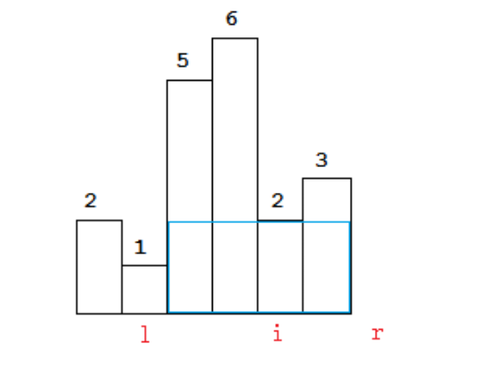

# Largest Rectangle in Histogram

## Problem Description

**Problem Link:** [Largest Rectangle in Histogram](https://leetcode.com/problems/largest-rectangle-in-histogram/)

Given an array of integers `heights` representing the histogram's bar height where the width of each bar is `1`, return *the area of the largest rectangle in the histogram*.

**Example 1:**

```
Input: heights = [2,1,5,6,2,3]
Output: 10
Explanation: The above is a histogram where width of each bar is 1.
The largest rectangle is shown in the red area, which has an area = 10 units.
```

**Example 2:**

```
Input: heights = [2,4]
Output: 4
```

**Constraints:**
- `1 <= heights.length <= 10^5`
- `0 <= heights[i] <= 10^4`

## Intuition/Main Idea

The key insight is to use a **monotonic stack** to efficiently find the largest rectangle. For each bar, we want to find the largest rectangle that uses that bar as its shortest bar (the limiting height).

**Core Algorithm:**
1. Use a stack to keep track of indices of bars in increasing order of height.
2. For each bar, if it's shorter than the bar at the top of the stack, we calculate the area of rectangles ending at the previous taller bars.
3. The width of a rectangle ending at index `i` is determined by the distance from the previous smaller bar (on the stack) to the current position.

**Why this works:** When we encounter a bar shorter than the one at the top of the stack, it means we've found the right boundary for all rectangles that use the taller bars. We can then calculate their areas and remove them from consideration, as they can't extend further right.

## Code Mapping

| Problem Requirement | Java Code Section (Relevant Lines) |
|---------------------|-----------------------------------|
| Track bar indices in increasing height order | Stack data structure - Line 5 |
| Calculate rectangle area for each bar | Area calculation in while loop - Lines 12-15 |
| Find left boundary (previous smaller bar) | Stack peek operation - Line 11 |
| Find right boundary (current smaller bar) | Current index `i` - Line 10 |
| Handle remaining bars after iteration | Final while loop - Lines 18-22 |
| Return maximum area found | `maxArea` variable - Lines 6, 15, 22 |

## Final Java Code & Learning Pattern

```java
import java.util.Stack;

class Solution {
    public int largestRectangleArea(int[] heights) {
        // Stack to store indices of bars in increasing order of height
        // We use indices instead of actual heights to calculate width later
        Stack<Integer> stack = new Stack<>();
        int maxArea = 0;
        int n = heights.length;

        // Iterate through all bars
        for (int i = 0; i < n; i++) {
            // When we encounter a bar shorter than what's on top of our stack:
            // This means we've found the right boundary for all taller bars in the stack
            // We need to calculate the maximum rectangle area using each of those taller bars
            while (!stack.isEmpty() && heights[stack.peek()] > heights[i]) {
                // Pop the tallest bar - this will be the height of our rectangle
                int height = heights[stack.pop()];

                // Now we need to determine how wide this rectangle can be:
                // - Right boundary is the current position (i) where height decreases
                // - Left boundary is the next bar on the stack (which must be shorter)
                //   or the start of the array if stack is empty

                // If stack is empty, all bars to the left were taller,
                // so rectangle extends from position 0 to i-1 (width = i)
                // Otherwise, rectangle extends from position stack.peek()+1 to i-1
                // (width = i - stack.peek() - 1)
                int width = stack.isEmpty() ? i : i - stack.peek() - 1;

                // Why subtract 1? Because:
                // - i is the current position (right boundary + 1)
                // - stack.peek() is the previous smaller bar position (left boundary - 1)
                // - So the width is (right - left - 1) = (i - stack.peek() - 1)

                // Calculate area and update maximum
                int area = height * width;
                maxArea = Math.max(maxArea, area);
            }

            // After processing all taller bars, push current bar's index
            // This maintains our monotonically increasing stack property
            stack.push(i);
        }

        // Process remaining bars in stack
        // These bars extend to the end of the histogram since we never found a shorter bar
        while (!stack.isEmpty()) {
            int height = heights[stack.pop()];

            // Similar width calculation as before, but now the right boundary
            // is the end of the array (position n)
            // If stack is empty, rectangle spans the entire array (width = n)
            // Otherwise, it spans from stack.peek()+1 to n-1 (width = n - stack.peek() - 1)
            int width = stack.isEmpty() ? n : n - stack.peek() - 1;

            int area = height * width;
            maxArea = Math.max(maxArea, area);
        }

        return maxArea;
    }
}
```

**Visual Explanation of Width Calculation Using the Histogram Image:**

Let's use the following histogram as an example:



In this histogram, we have heights = [2, 1, 5, 6, 2, 3] with indices 0 to 5.

Let's walk through the algorithm step by step:

1. We start with an empty stack.

2. At index 0 (height 2):
    - Push index 0 onto stack.
    - Stack: [0] (with height 2)

3. At index 1 (height 1):
    - Height 1 is less than heights[0] = 2, so we pop index 0.
    - Calculate area: height = 2, width = 1 (since stack is empty), area = 2 * 1 = 2
    - Push index 1 onto stack.
    - Stack: [1] (with height 1)

4. At index 2 (height 5):
    - Height 5 is greater than heights[1] = 1, so we push index 2.
    - Stack: [1, 2] (with heights 1, 5)

5. At index 3 (height 6):
    - Height 6 is greater than heights[2] = 5, so we push index 3.
    - Stack: [1, 2, 3] (with heights 1, 5, 6)

6. At index 4 (height 2):
    - This is where the key width calculation happens!
    - Height 2 is less than heights[3] = 6, so we pop index 3.
    - Calculate area: height = 6, width = 4 - 2 - 1 = 1, area = 6 * 1 = 6
    - Height 2 is still less than heights[2] = 5, so we pop index 2.
    - Calculate area: height = 5, width = 4 - 1 - 1 = 2, area = 5 * 2 = 10
    - Height 2 is greater than heights[1] = 1, so we stop popping.
    - Push index 4 onto stack.
    - Stack: [1, 4] (with heights 1, 2)

   In the image, this corresponds to the blue rectangle formed with height 5 and width 2 (spanning from just after position 'l' to position 'i'-1). This gives us the largest rectangle so far with area 10.

7. At index 5 (height 3):
    - Height 3 is greater than heights[4] = 2, so we push index 5.
    - Stack: [1, 4, 5] (with heights 1, 2, 3)

8. After processing all bars, we handle the remaining indices in the stack:
    - Pop index 5: height = 3, width = 6 - 4 - 1 = 1, area = 3 * 1 = 3
    - Pop index 4: height = 2, width = 6 - 1 - 1 = 4, area = 2 * 4 = 8
    - Pop index 1: height = 1, width = 6 (since stack is empty), area = 1 * 6 = 6

9. The maximum area is 10, which corresponds to the rectangle with height 5 and width 2 in the image (marked with the blue outline).

**Key Insight from the Image:**

In the image, we can see:
- The positions labeled as 'l', 'i', and 'r' correspond to the left boundary, current position, and right boundary.
- When we encounter height 2 at position 'i', we need to calculate the area for the taller bars (heights 5 and 6).
- For height 5, the width extends from just after position 'l' to position 'i'-1, giving width = i - l - 1.
- This is exactly what our code does with `width = stack.isEmpty() ? i : i - stack.peek() - 1`.

The blue rectangle in the image represents the largest rectangle with area 10 (height 5 × width 2).

## Complexity Analysis

- **Time Complexity:** $O(n)$ where $n$ is the number of bars. Each bar is pushed and popped from the stack exactly once.

- **Space Complexity:** $O(n)$ for the stack in the worst case when all bars are in increasing order.

## Similar Problems

Problems that can be solved using similar monotonic stack patterns:

1. **42. Trapping Rain Water** - Uses stack to track decreasing heights
2. **739. Daily Temperatures** - Monotonic stack to find next greater element
3. **496. Next Greater Element I** - Stack-based next greater element
4. **503. Next Greater Element II** - Circular array variant
5. **907. Sum of Subarray Minimums** - Similar rectangle area calculation
6. **85. Maximal Rectangle** - Extension to 2D using this problem's approach
7. **316. Remove Duplicate Letters** - Monotonic stack for lexicographical order
8. **402. Remove K Digits** - Stack to maintain increasing sequence
9. **456. 132 Pattern** - Stack to track decreasing sequence
10. **84. Largest Rectangle in Histogram** (this problem) - Classic monotonic stack problem
